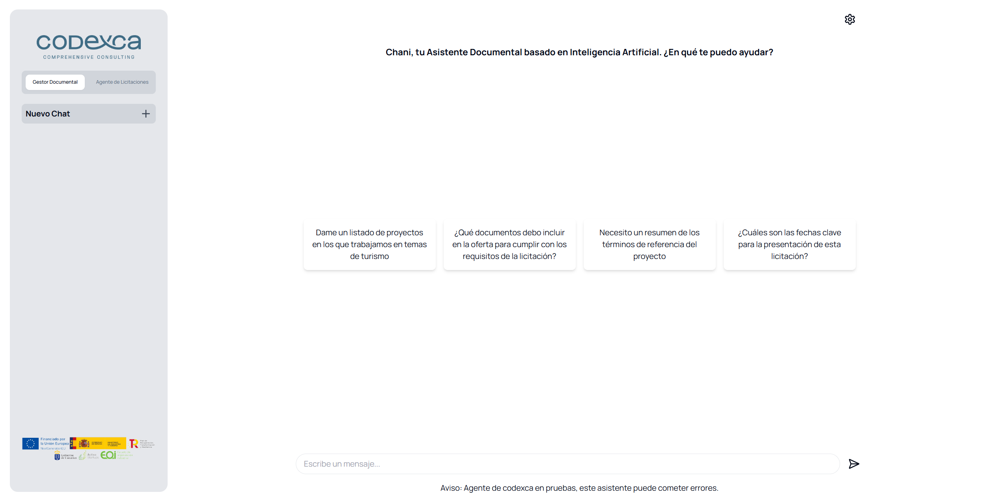

# UI-Asistente

El proyecto “Sistema de IA Generativa para la gestión de licitaciones públicas” se enmarca dentro del programa “Activa Startups” del Plan de Recuperación, Transformación y Resiliencia, cuyo propósito es fomentar la digitalización de las pymes a través de la implementación de soluciones innovadoras basadas en tecnologías emergentes. El objetivo del programa es mejorar la competitividad de las empresas mediante la adopción de herramientas avanzadas que faciliten la automatización y optimización de procesos críticos. En este contexto, Mottum Analytica propone una solución basada en un Modelo de Lenguaje (LLM) para abordar las necesidades específicas de CODEXCA en la gestión de su patrimonio documental y operativa interna. A continuación, se describe técnicamente la lógica e implementación de la solución.



## Ejecución en local :computer:

### Prerrequisitos

Asegúrate de tener instalados previamente los siguientes componentes:

- [Node.js](https://nodejs.org/en/download/prebuilt-installer/) v.22
- [Docker](https://www.docker.com/products/docker-desktop/) (Si se hace el despliegue con esta herramienta)

A continuación, se muestra el despliegue tanto en local como en un contenedor Docker

### Despliegue en local :house:

1. **Clonar el repositorio**
   
   Primero, clona el repositorio y situate en el directorio clonado:
   ```bash
   git clone https://github.com/MottumData/UI-Asistente.git
   ```

2. **Instalación de dependencias**
    ```bash
    npm install
    ```
3. **Ejecutar UI en local (develop)**
    ```bash
    npm run dev
    ```
4. **Ejecutar UI en local (production)**
    ```bash
    npm run start
    ```

### Despliegue con Docker :whale:

1. **Clonar el repositorio**
   
   Primero, clona el repositorio y situate en el directorio clonado:
   ```bash
   git clone https://github.com/MottumData/UI-Asistente.git
   ```
2. **Crear imagen de Docker**
    ```bash
    docker build -t ui-codexca .
    ```
3. **Ejecutar contenedor Docker**
    
    ```bash
    docker run -p 3000:3000 ui-codexca
    ```